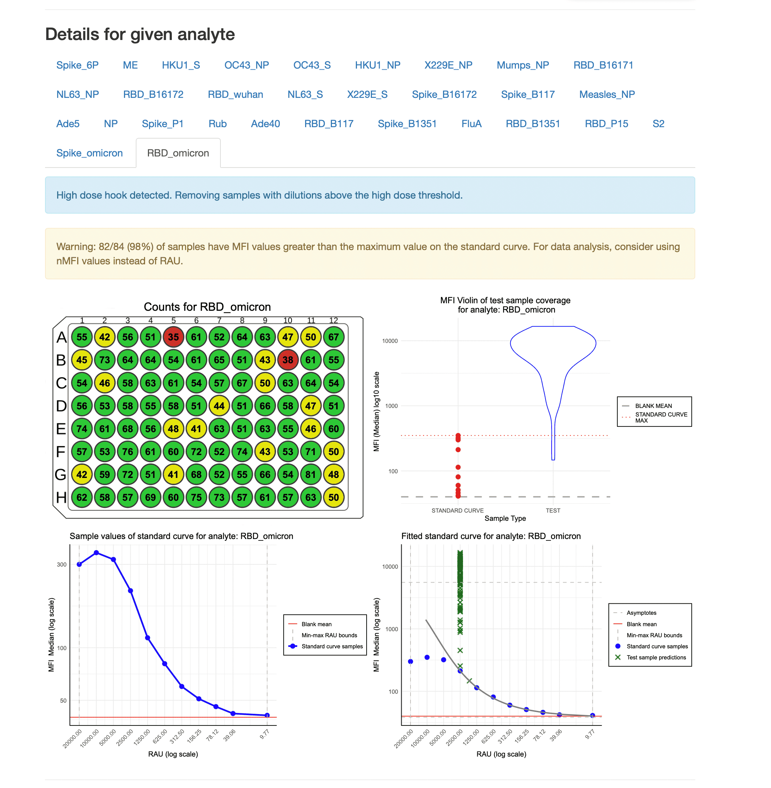

```{r setup, include=FALSE}
knitr::opts_chunk$set(
  collapse = FALSE,
  comment = "#>",
  warning = FALSE,
  message = FALSE,
  dpi = 50,
  out.width = "70%"
)
```


# Introduction

The `SerolyzeR` package provides for two reports:
- plate report that can be generated using the `generate_plate_report` function,
- Levey-Jennings report that can be generated using the `generate_levey_jennings_report` function. 

They are HTML report that were optimized for size so they could be sent via email.
The first one contains a summary of the plate. It includes information about the plate, the layout of the plate, the preview of standard curves, and detailed information about analytes.
The second one contains information about the quality control over time. It includes plots of stacked standard curves and Levey-Jennings plots for each analyte.

# Plate summary report

## Generating the report

To present this functionality, we use a sample dataset from the Covid OISE study, which is pre-loaded into the package. 
Firstly, let us load the dataset as the `plate` object.

```{r}
library(SerolyzeR)

plate_filepath <- system.file("extdata", "CovidOISExPONTENT.csv", package = "SerolyzeR", mustWork = TRUE)
layout_filepath <- system.file("extdata", "CovidOISExPONTENT_layout.xlsx", package = "SerolyzeR", mustWork = TRUE)
plate <- read_luminex_data(plate_filepath, layout_filepath)

plate
```

To generate the report, we need to use the `generate_plate_report` function. There is one parameter that needs to be set, which is the `plate` object.
Generation of the report takes a few seconds, so please be patient. It can take up to a minute for a large plate.

```{r, eval=FALSE}
generate_plate_report(plate)
```

Default report has 4 main sections:

- The most important information about the plate


- The layout of the plate


- The preview of standard curves


- Detailed information about analytes: this section has tabs for each analyte, where the user can select the analyte of interest.


## Warnings 

The plate report displays warnings in a nice visual manner. For now, two types of warnings are supported:
- `high dose hook warning` - that informs the user that there is a high dose hook for a given analyte
- `bad coverage warning` - it shows if more than 25% of the test samples have an MFI value above the highest standard curve point

The warnings are displayed in the `detailed information about analytes` section. 



## Additional parameters

The user can customize the report by setting additional parameters. 
The `generate_plate_report` function has the following optional parameters:

- `additional_notes` - string with additional notes that will be added to the report

```{r, eval=FALSE}
notes <- "
This is an example of additional notes that can be added to the report.
The notes support markdown syntax, for example:
**Author: Jane Doe** - bold
*Date: 2024-10-28* - italic
~~Completed~~ - strikethrough
H~2~O - subscripts
X^2^ - superscripts
[text that will be displayed](https://www.google.com) - link to resource

Ordered list:
1. First item
2. Second item
3. Third item

Unordered list:
- First item
- Second item
- Third item

> This is a blockquote

#### This is a heading
##### This is a subheading
###### This is a subsubheading

Even though headings #, ##, ### are supported, it is recommended not to use them, as the report has its own structure that is built around ### headings.
"
generate_plate_report(plate, additional_notes = notes)
```

Such notes looks like this in the report:


- `counts_lower_threshold` - the lower threshold for counts plot, works the same way as in the `plot_counts` function
it is used to change the threshold between green and yellow colours
- `counts_higher_threshold` - the higher threshold for counts plot, works the same way as in the `plot_counts` function
it is used to change the threshold between yellow and red colours
- `filename` - The name of the output HTML report file. If not provided or equals to `NULL`, 
the output filename will be based on the plate name, precisely: `{plate_name}_report.html`.
 By default the `plate_name` is the filename of the input file that contains the plate data.
 For more details, please refer to the documentation about the `Plate` object. If the passed filename does not contain the `.html` extension, the default extension `.html` will be added.
 Filename can also be a path to a file, e.g. `path/to/file.html`. In this case, the `output_dir` and `filename` will be joined together.
 However, if the passed filepath is an absolute path and the `output_dir` parameter is also provided, the `output_dir` parameter will be ignored.
 If a file already exists under a specified filepath, the function will overwrite it.
- `output_dir` - The directory where the output CSV file should be saved. Please note that any directory path provided will create all necessary directories (including parent directories) if they do not exist.
 If it equals to `NULL` the current working directory will be used. Default is 'reports'.

```{r, eval=FALSE}
generate_plate_report(plate,
  additional_notes = notes,
  counts_lower_threshold = 10,
  counts_higher_threshold = 100,
  filename = "example_report.html",
  output_dir = "reports_from_new_plates"
)
```

# Levey-Jennings report

## Generating the report

To present this functionality, we use a sample dataset from the Covid OISE study, which is pre-loaded into the package.
Firstly, let us load the dataset as the `list_of_plates` object.

```{r, eval=FALSE}
dir <- system.file("extdata", "multiplate_reallife_reduced",
  package = "SerolyzeR", mustWork = TRUE
)

# Create a temporary directory for the output
output_dir <- tempdir(check = TRUE)
dir.create(output_dir)
list_of_plates <- process_dir(dir,
  return_plates = TRUE,
  format = "xPONENT",
  output_dir = output_dir
)

# Clean up the output directory
unlink(output_dir, recursive = TRUE)
```

To generate the report, we need to use the `generate_levey_jennings_report` function. There are two parameters that need to be set, which are:
- `list_of_plates` - list of `Plate` instances, it is recommended generate is with `process_dir` function
- `report_title` - title of the report

Generation of the report takes a several minutes, so please be patient. It can take up around 5 minutes for reports with more than 30 plates.

```{r, eval=FALSE}
generate_levey_jennings_report(list_of_plates, report_title = "Example study")
```

Default report has 3 main sections:

- The most important information about the report

This section contains information about the report, the number of plates, the number of analytes, list of dilutions, and the date range of the plates.
It also contains list of plates used to crate report. This list can be hidden by clicking on the "Show/hide plates" button. 

- Layout of the plate

This part of report contains a plot with the layout of the plate. 
To create this visualization, the first plate from the list (oldest one) is used.

- Detailed information about analytes

This section contains tabs for each analyte. Each tab contains two types of plots: stacked standard curves and Levey-Jennings plots.
First type of plot shows the stacked standard curves for each plate, there are two version of this plot included in the report: monochromatic and colored.
Then there is second type of plot, Levey-Jennings plot. This plot shows the concentration of the analyte over time. By default there are plotted two 
charts for dilution "1/100" and "1/400".

## Additional parameters

The user can customize the report by setting additional parameters.
The `generate_levey_jennings_report` function has the following optional parameters:

- `dilutions` - vector of dilutions that will be used to create Levey-Jennings plots. By default, it is set to `c("1/100", "1/400")`
- `additional_notes` - string with additional notes that will be added to the report, works the same way as in the `generate_plate_report` function
- `filename` - The name of the output HTML report file. It works the same way as in the `generate_plate_report` function
- `output_dir` - The directory where the output CSV file should be saved. It works the same way as in the `generate_plate_report` function
