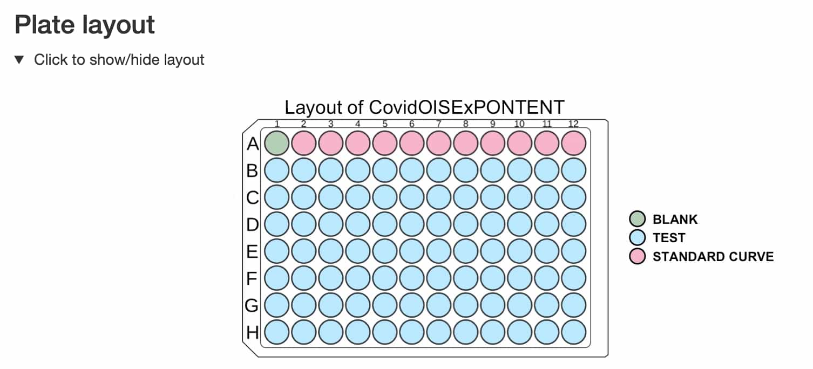
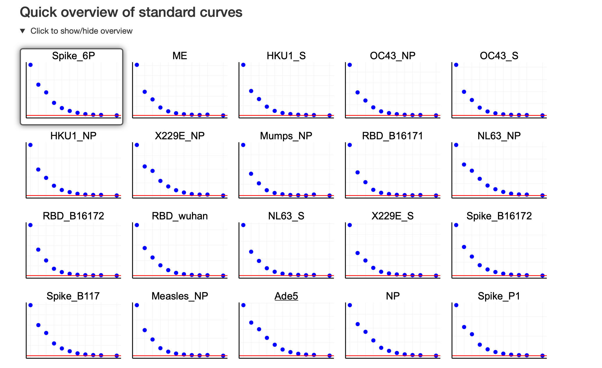
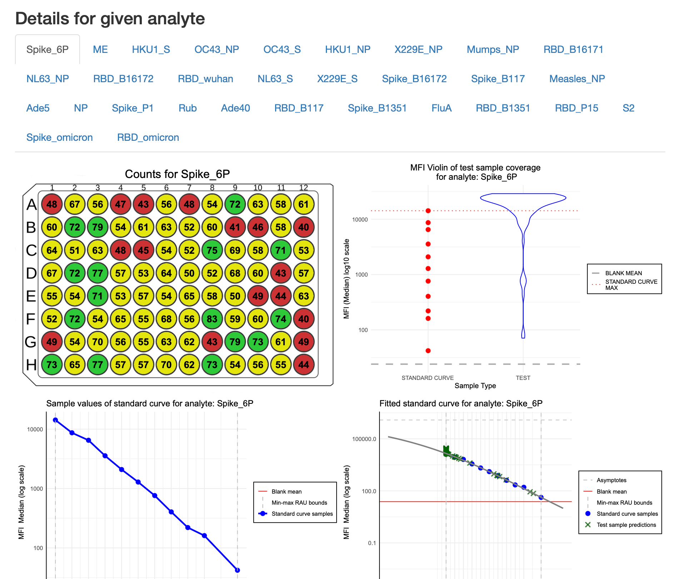
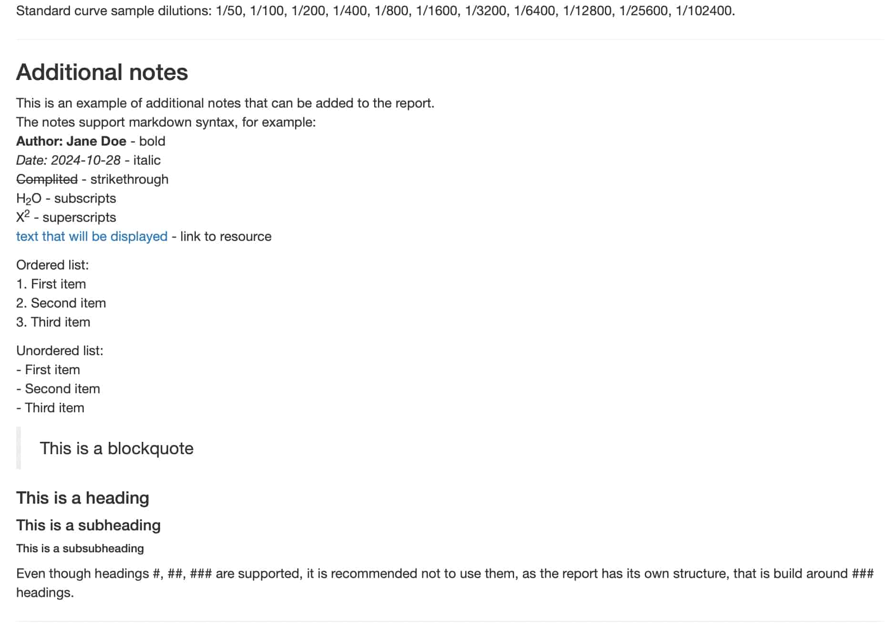

```{r setup, include=FALSE}
knitr::opts_chunk$set(
  collapse = FALSE,
  comment = "#>",
  warning = FALSE,
  message = FALSE,
  dpi = 50,
  out.width = "70%"
)
```

# Introduction

The `PvSTATEM` package provides, for now, one report that can be generated using the `generate_plate_report` function. 
It is an HTML report that contains a summary of the plate. It was optimized for size so it could be sent via email. 
In the future, we plan to add to the package report about Levey-Jennings plots. For now, we will focus on the plate summary report. 
To present this functionality, we use a sample dataset from the Covid OISE study, which is pre-loaded into the package. 
Firstly, let us load the dataset as the `plate` object.

```{r}
library(PvSTATEM)

plate_filepath <- system.file("extdata", "CovidOISExPONTENT.csv", package = "PvSTATEM", mustWork = TRUE)
layout_filepath <- system.file("extdata", "CovidOISExPONTENT_layout.xlsx", package = "PvSTATEM", mustWork = TRUE)
plate <- read_luminex_data(plate_filepath, layout_filepath)

plate
```

# Generating the report

To generate the report, we need to use the `generate_plate_report` function. There is one parameter that needs to be set, which is the `plate` object.
Generation of the report takes a few seconds, so please be patient. It can take up to a minute for a large plate.

```{r, eval=FALSE}
generate_plate_report(plate)
```

Default report has 4 main sections:

- The most important information about the plate


- The layout of the plate



- The preview of standard curves



- Detailed information about analytes: this section has tabs for each analyte, where the user can select the analyte of interest.



# Additional parameters

The user can customize the report by setting additional parameters. 
The `generate_plate_report` function has the following optional parameters:

- `additonal_notes` - string with additional notes that will be added to the report

```{r, eval=FALSE}
notes <- "
This is an example of additional notes that can be added to the report.
The notes support markdown syntax, for example:
**Author: Jane Doe** - bold
*Date: 2024-10-28* - italic
~~Complited~~ - strikethrough
H~2~O - subscripts
X^2^ - superscripts
[text that will be displayed](https://www.google.com) - link to resource

Ordered list:
1. First item
2. Second item
3. Third item

Unordered list:
- First item
- Second item
- Third item

> This is a blockquote 

#### This is a heading
##### This is a subheading
###### This is a subsubheading

Even though headings #, ##, ### are supported, it is recommended not to use them, as the report has its own structure that is built around ### headings.
"
generate_plate_report(plate, additional_notes = notes)
```

Such notes looks like this in the report:




- `counts_lower_threshold` - the lower threshold for counts plot, works the same way as in the `plot_counts` function
it is used to change the threshold between green and yellow colours
- `counts_higher_threshold` - the higher threshold for counts plot, works the same way as in the `plot_counts` function
it is used to change the threshold between yellow and red colours
- `filename` - The name of the output HTML report file. If not provided or equals to `NULL`, 
the output filename will be based on the plate name, precisely: `{plate_name}_report.html`.
 By default the `plate_name` is the filename of the input file that contains the plate data.
 For more details, please refer to the documentation about the `Plate` object. If the passed filename does not contain the `.html` extension, the default extension `.html` will be added.
 Filename can also be a path to a file, e.g. `path/to/file.html`. In this case, the `output_dir` and `filename` will be joined together.
 However, if the passed filepath is an absolute path and the `output_dir` parameter is also provided, the `output_dir` parameter will be ignored.
 If a file already exists under a specified filepath, the function will overwrite it.
- `output_dir` - The directory where the output CSV file should be saved. Please note that any directory path provided will create all necessary directories (including parent directories) if they do not exist.
 If it equals to `NULL` the current working directory will be used. Default is 'reports'.

```{r, eval=FALSE}
generate_plate_report(plate, 
                      additional_notes = notes,
                      counts_lower_threshold = 10,
                      counts_higher_threshold = 100,
                      filename = "example_report.html",
                      output_dir = "reports_from_new_plates")
```

